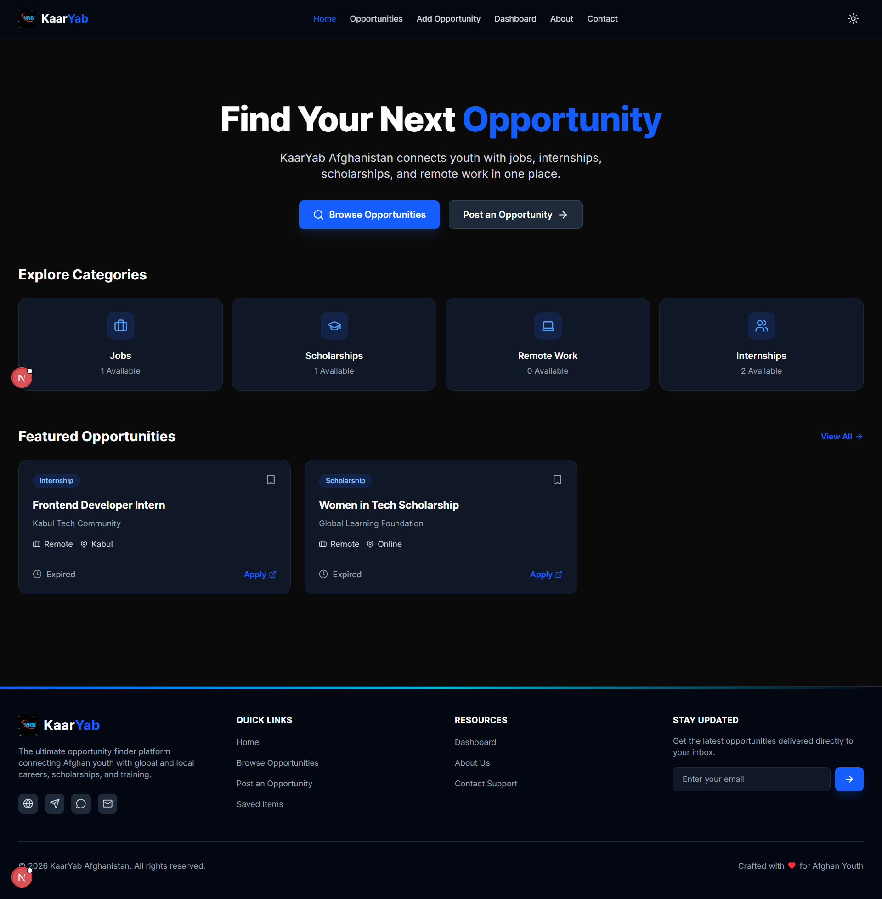
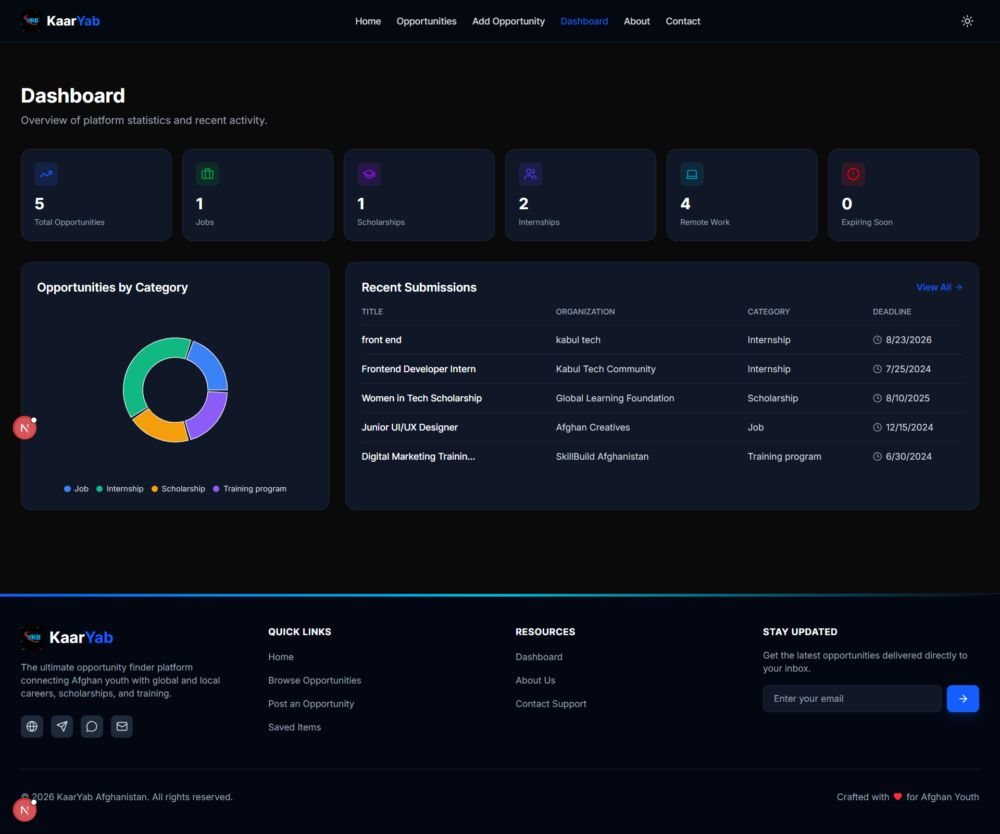
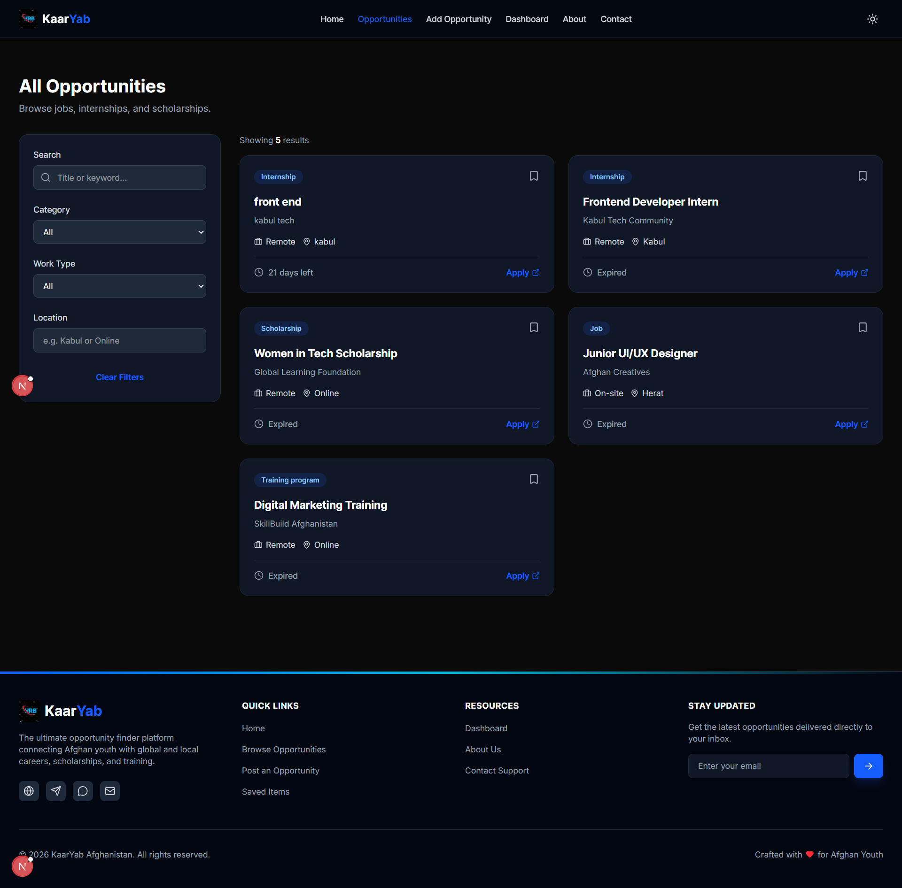
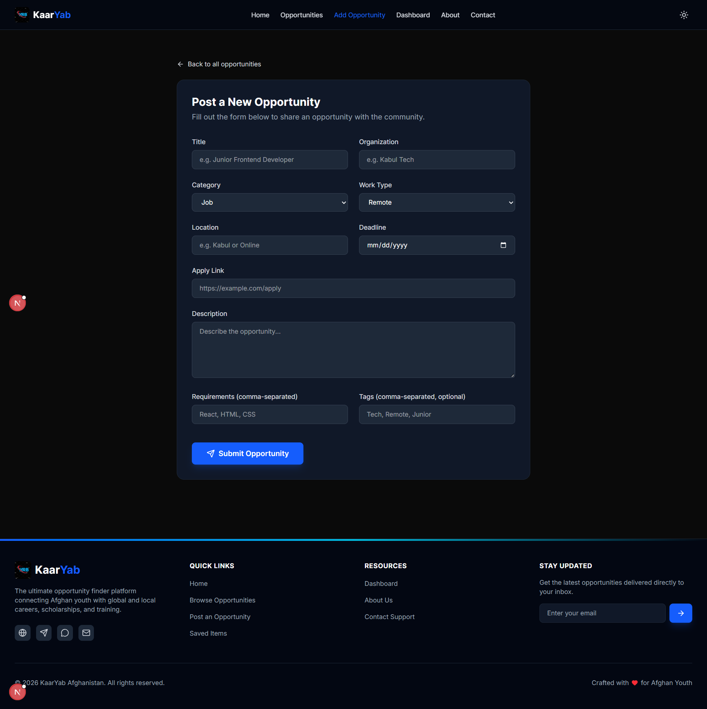

<!-- ```markdown -->
# 🇦🇫 KaarYab Afghanistan - Opportunity Finder Platform

**Final Project One-Line Description:** 
KaarYab Afghanistan is a modern opportunity finder platform that helps Afghan youth discover jobs, internships, scholarships, remote work, and skill-building opportunities in one place.

> **⚠️ Note on Data:** The data displayed on this platform is clearly marked as "Demo Data" for educational purposes. It does not represent real, active job listings or scholarships.

---

## 📖 Project Description
KaarYab is a modern, responsive web application designed to connect Afghan youth with global and local opportunities. The platform allows users to browse, search, filter, save, and submit opportunities such as jobs, internships, scholarships, online courses, and training programs. Built as a final capstone project, it demonstrates modern React and Next.js development practices, clean architecture, and professional UI/UX design.

## 🎯 Problem It Solves
Information regarding jobs, scholarships, and training programs in Afghanistan is often scattered across different websites, social media pages, and Telegram groups. This makes it difficult for students and job seekers to find useful opportunities in one place. 

**KaarYab solves this problem** by creating a clean, easy-to-use platform where people can find all these opportunities in one centralized location. 

### Target Users
- Students and Fresh Graduates
- Job Seekers
- Women looking for remote opportunities
- Organizations that want to share opportunities

---

## ✨ Features

### Core Features
- **Opportunity Listing:** Browse jobs, internships, scholarships, and remote work.
- **Advanced Search & Filter:** Search by title, and filter by category, location, and work type (Remote/On-site).
- **Dynamic Details Page:** Dedicated pages for each opportunity (`/opportunities/[id]`) with full descriptions, requirements, and apply links.
- **Save Feature:** Bookmark opportunities to view later (persisted via LocalStorage).
- **Add Opportunity Form:** A fully validated form using React Hook Form and Zod for organizations to post new opportunities.
- **Full CRUD System:** Users can Create, Read, Update, and Delete opportunities.
- **Interactive Dashboard:** Visual statistics of total jobs, scholarships, and remote work using cards and charts.
- **Responsive Design:** Fully optimized for mobile, tablet, and desktop devices.
- **Dark Mode:** A robust light/dark mode toggle using `next-themes`.

### Bonus Features Implemented
- ⏳ **Deadline Countdown:** Shows how many days are left to apply on details pages.
- 🚨 **Expiring Soon Badge:** Highlights opportunities closing within 7 days on cards.
- 📊 **Data Visualization:** Interactive pie charts on the dashboard using Recharts.
- 🎬 **Framer Motion Animations:** Smooth, premium UI transitions and hover effects.
- ⭐ **Featured Opportunities:** Highlighting specific opportunities on the home page.

---

## 🛠️ Technologies Used

- **Framework:** Next.js (App Router)
- **Language:** TypeScript
- **Styling:** Tailwind CSS (v4)
- **State Management:** React Context API & LocalStorage
- **Form Handling:** React Hook Form & Zod Validation
- **Charts:** Recharts
- **Animations:** Framer Motion
- **Icons:** Lucide React
- **Theming:** Next-Themes

---

## 🚀 How to Run Locally

Follow these steps to set up the project on your local machine.

### Prerequisites
- Node.js (v18 or higher)
- npm or yarn

### Installation & Setup

1. **Clone the repository**
   ```bash
   git clone [https://github.com/zarifa1401/kaaryab-afghanistan.git]
   cd kaaryab-afghanistan
   ```

2. **Install dependencies**
   ```bash
   npm install
   ```

3. **Run the development server**
   ```bash
   npm run dev
   ```

4. Open [http://localhost:3000](http://localhost:3000) in your browser to see the application.

---

## 📸 Screenshots

**Home Page:**


**Dashboard:**


**Opportunities Page:**


**Add Opportunity Form:**


---

## 🔗 Links

- **Live Demo Link:** [https://kaaryab-afghanistan-khaki.vercel.app/]
- **GitHub Link:** [https://github.com/zarifa1401/kaaryab-afghanistan]

---

## 🔮 Future Improvements

- **Multi-language Support:** Adding English, Dari, and Pashto translations.
- **Authentication:** User login/signup for personalized dashboards and profiles.
- **PDF CV Builder:** Allowing users to generate and download their resumes directly from the platform.
- **Admin Approval System:** Requiring admin approval before newly submitted opportunities go live to the public.
- **Email/Contact API Integration:** Sending automated email notifications for expiring opportunities or form submissions.

---

## 📝 License & Acknowledgments
This project was built for educational purposes as a Final Capstone Project. 

Made with ❤️ for Afghan Youth.
```